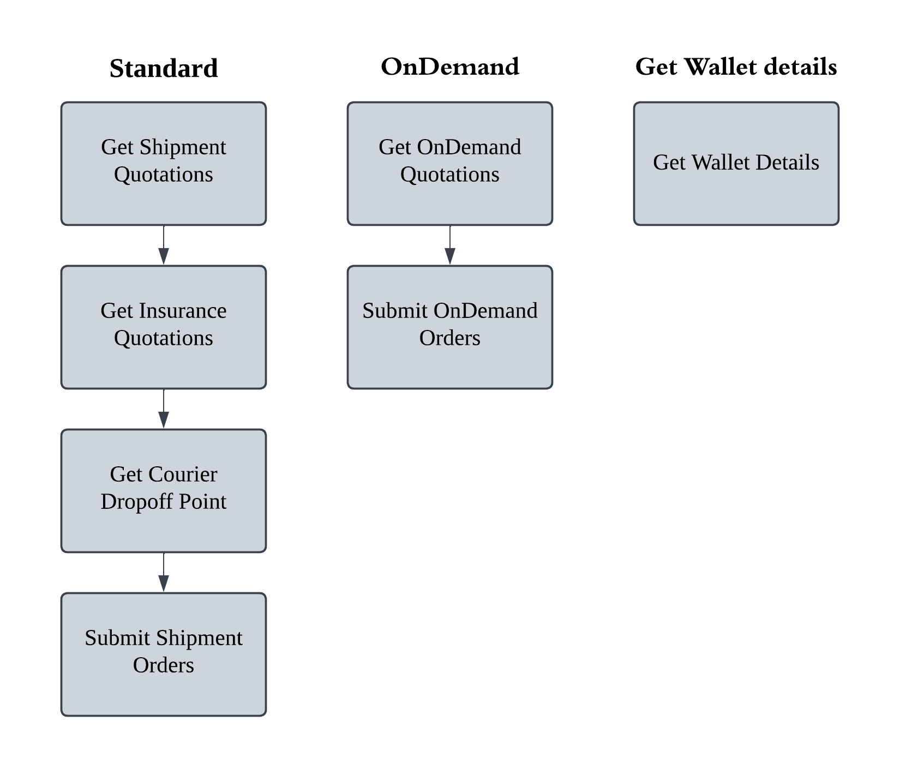

## Features / Endpoints

#### [Back to official documents](../README.md)

Below are all the Functions and Endpoints available for the API

### [Shipping](Shipping)

- Scheduled Delivery

- Cost-effective

- Tracking Available
  
[Get Shipment Quotation](Shipping/get_Shipment_Quotation.md)

[Get Insurance Quotation](Shipping/get_Insurance_Quotation.md)

[Get Courier Dropoff point](Shipping/get_Courier_Dropoff_point.md)

[Submit Shipment Orders](Shipping/Submit_Shipment_Orders.md)

### [OnDemand](OnDemand)

- Speed: providing same-day delivery.

- Real-Time Tracking: You can track your parcel in real-time once the booking is made.

- Flexibility: You can choose your preferred vehicle and schedule the pick-up time.

- Cost-Efficiency: You only pay for the services you need.

- Priority Handling: Parcels are prioritized, ensuring faster delivery compared to standard methods.

[Get OnDemand Quotation](OnDemand/get_OnDemand_Quotation.md)

[Submit OnDemand Order](OnDemand/Submit_OnDemand_Order.md)

### Wallet

[Get Wallet](get_Wallet.md)
