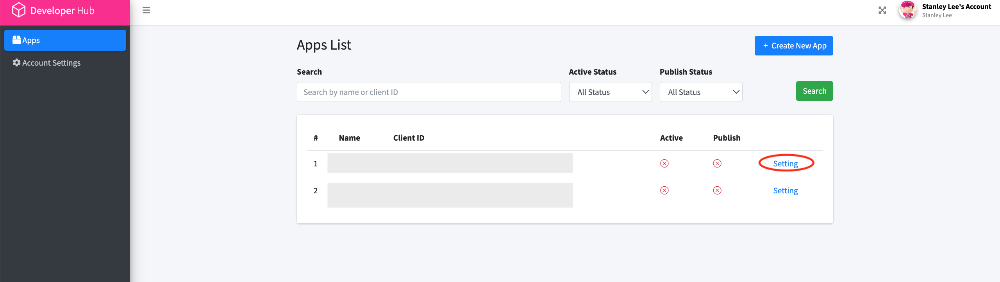
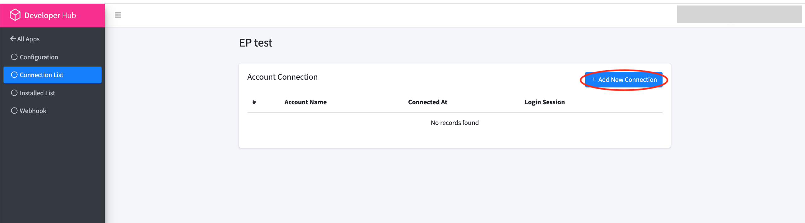
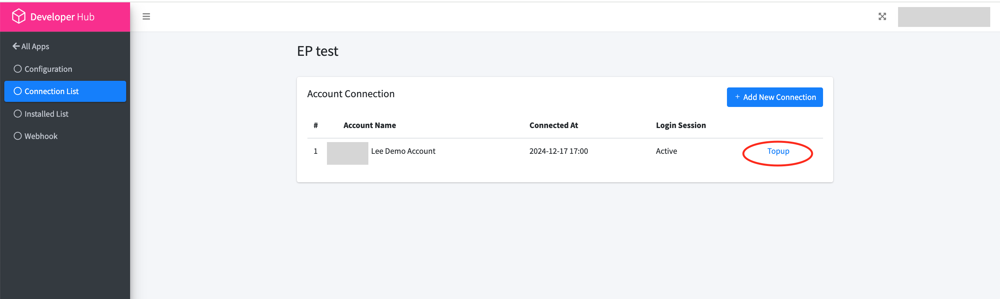
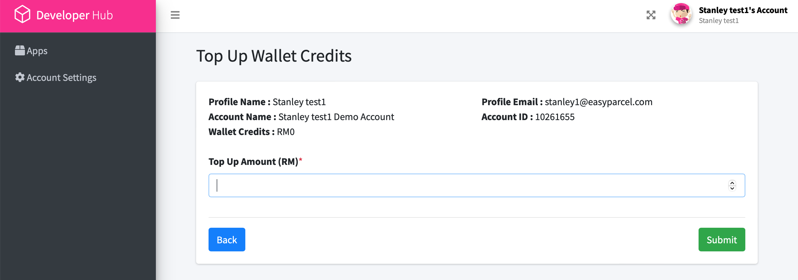
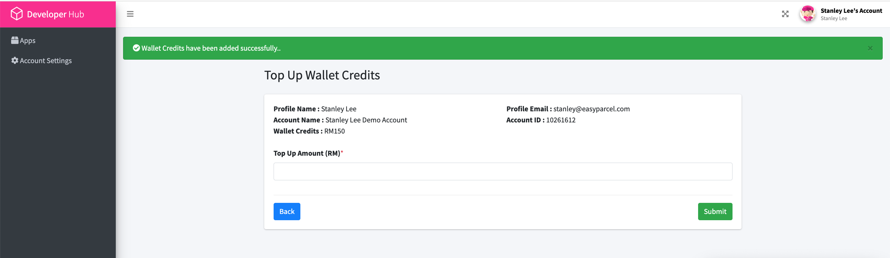

## Setup demo account  | [Top up demo account](#Top-up-demo-account)

#### [Get started with API](1.get_started_with_easy_pracel_open_API.md) | [Back to official documentation](../README.md)

#### Steps to setup demo account
1.) Login to developer https://developer.easyparcel.com

2.)Select Application and select settings of the application desire

3.)Select Connection list

4.)Add connection list

5.)Demo account created

### Top up demo account
1.) in the Application settings, connection list, select top up

2.) Top up the amount desire.

3.)Top up successful

4.) Continue with [EASY PARCEL API SETUP](Get_started_with_easy_parcel_open_API.md)
