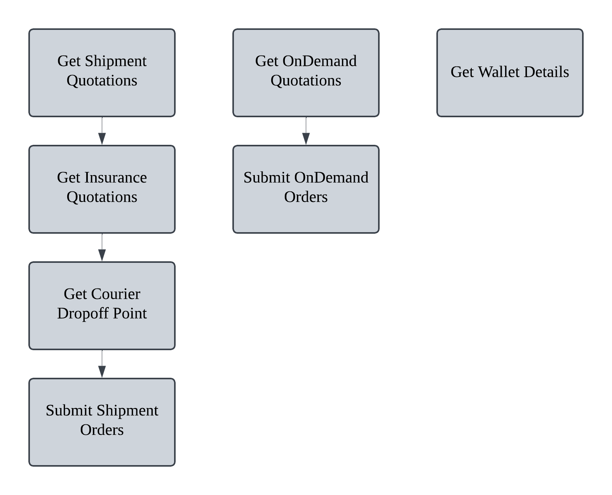

# Easy Parcel API  

 
The EasyParcel API allows your application to access current data within EasyParcel. However, EasyParcel API is using RESTful to develop API for web based applications. Through the API, several common operations can be performed on EasyParcel objects.

---

## Table of Contents 
- [Guides](#Guides)
- [Oauth](#Oauth-Authentication)
- [Features](#API-Functions-Features)
- [Order Flow](#Order-function-Flow)
- [References](#References)

---

### Guides
#### Follow the guide below to integrate with easy parcel api.

#### [Steps to get started with EASYPARCEL](Guides/1.get_started_with_EASY_PARCEL_OPEN_API.md)
#### [Setup Demo Account](Guides/2.setup_demo_account.md)
#### [Get Oauth Access token](Guides/3.get_Oauth_Access_token.md)

---
### Oauth Authentication

EasyParcel's API employs the OAuth 2.0 authorization framework to provide secure and controlled access to its services.

#### [More about Oauth Authentication](oauth_authentication.md)
#### [Steps to get Oauth Access token](Guides/steps_to_get_oauth_access_token.md)
---

### API Functions Features

#### [Functions/Features](Features/README.md)

##### Standard

[Get Shipment Quotation](Features/Shipping/1.get_shipment_quotation.md)

[Get Insurance Quotation](Features/Shipping/2.get_insurance_quotation.md)

[Get Courier Dropoff point](Features/Shipping/3.get_courier_dropoff_point.md)

[Submit Shipment Orders](Features/Shipping/4.submit_shipment_orders.md)

##### OnDemand

[Get OnDemand Quotation](Features/OnDemand/1.get_ondemand_quotation.md)

[Submit OnDemand Order](Features/OnDemand/2.submit_ondemand_order.md)

##### Wallet

[Get Wallet](Features/get_wallet.md)

---

### Order function Flow

---

### References

**[API Return Status](References/API_return_status.md)**

**[Conutry Code](References/country_code.md)**

**[ISO 3166](References/ISO_3166.md)**
